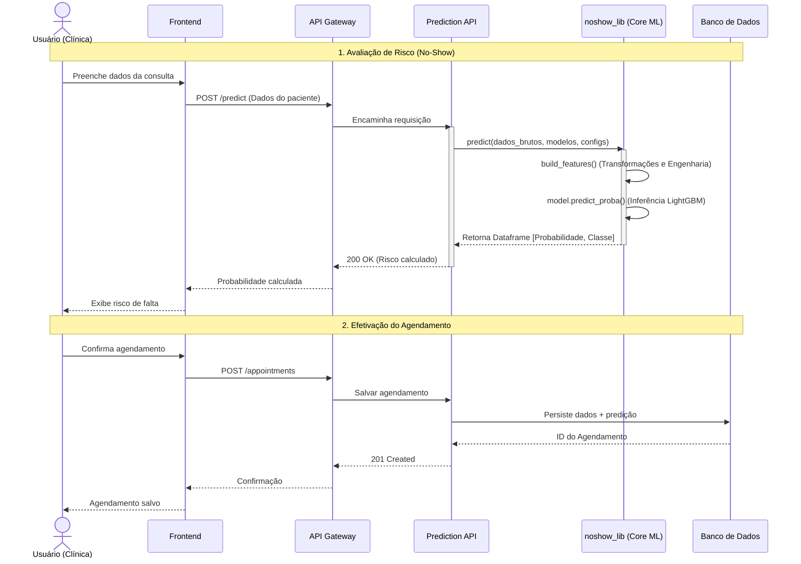

# No-Show Prediction API

## Visão geral

API FastAPI responsável por prever o risco de não comparecimento de pacientes em consultas médicas. Na inicialização, a API carrega automaticamente da Azure Blob Storage todos os modelos LightGBM treinados, um por grupo de especialidade médica, e os mantém em memória para garantir baixa latência nas predições. Isso elimina a necessidade de recarregar o modelo a cada requisição e permite inferência vetorizada, onde um lote inteiro de agendamentos é processado em uma única passagem pelo modelo.

A engenharia de atributos é delegada inteiramente ao `noshow_lib`, que aplica transformações temporais, históricas e contextuais de forma padronizada e reproduzível entre treino e inferência.

## Funcionalidades principais

- Predição individual: `POST /predict`
- Predição em lote: `POST /predict/batch` (até 250 agendamentos)
- Predição por intervalo de datas: `POST /predict/range`
- Verificação de saúde e estado dos modelos: `GET /health`
- Persistência de agendamentos e resultados de predição no banco de dados

## Como funciona

1. Na startup, os modelos e a configuração são baixados do Azure Blob e cacheados em memória
2. Cada requisição converte os dados recebidos em DataFrame com colunas em português
3. O `noshow_lib` aplica `build_features()` para gerar as variáveis de entrada
4. O modelo correspondente à especialidade é selecionado (ou o fallback geral)
5. `predict_proba()` retorna a probabilidade de no-show com o threshold calibrado
6. O resultado e o contexto do agendamento são persistidos no banco de dados

## Endpoints

- `GET /` ou `GET /health` — status da API e informações sobre os modelos carregados
- `POST /predict` — predição individual com dados de um agendamento
- `POST /predict/batch` — predição em lote (até 250 agendamentos por requisição)
- `POST /predict/range` — predição para um agendamento em diferentes datas (útil para escolher a melhor data)
- `POST /appointments` — persiste um agendamento com o resultado de predição
- `GET /appointments` — lista agendamentos com filtros

## Dados esperados

- `id`
- `Status`
- `Marcacao`
- `DataHoraConsulta`
- `Idade`
- `Sexo`
- `CidadePaciente`
- `BairroPaciente`
- `TipoConvenio`
- `idUnicoPaciente`
- `UnidadeAtendimento`
- `EnderecoUnidadeAtendimento`
- `CEPUnidadeAtendimento`
- `Especialidade`

## Banco de dados

A API persiste predições e feedback de comparecimento na tabela `appointment_predictions`. A tabela é criada automaticamente na startup via `Base.metadata.create_all()` caso não exista no banco configurado (Azure SQL / SQL Server via pyodbc).

| Coluna                                         | Descrição                                     |
| ---------------------------------------------- | --------------------------------------------- |
| `appointment_prediction_id`                    | Chave primária                                |
| `patient_id`, `specialty`, `scheduled_at`, ... | Contexto do agendamento                       |
| `prediction_class`, `probability_no_show`      | Saída do modelo                               |
| `appointment_status`                           | Feedback real (Realizado / Falta / Cancelado) |

## Estrutura do projeto

- `app/main.py` — inicialização do FastAPI, CORS, roteadores e criação de tabelas
- `app/routes/prediction_routes.py` — endpoints de predição
- `app/routes/appointment_routes.py` — endpoints de agendamentos
- `app/services/prediction_service.py` — pipeline de predição
- `app/services/model_manager.py` — gerenciamento e cache de múltiplos modelos por especialidade
- `app/services/blob_service.py` — download de modelos e configuração do Azure Blob
- `app/models/schemas.py` — validação de entrada e saída com Pydantic
- `app/models/db_models.py` — modelo SQLAlchemy da tabela de predições
- `app/database.py` — engine e sessão SQLAlchemy
- `app/config.py` — variáveis de ambiente e configuração
- `app/utils/logger.py` — logger centralizado

## Tecnologias principais

| Tecnologia                    | Por quê                                                                                                              |
| ----------------------------- | -------------------------------------------------------------------------------------------------------------------- |
| **FastAPI**                   | Framework assíncrono de alta performance, ideal para APIs de inferência onde latência importa                        |
| **noshow_lib**                | Garante que o mesmo pipeline de features usado no treino seja aplicado na predição, evitando _training-serving skew_ |
| **LightGBM** (via noshow_lib) | Algoritmo gradient boosting eficiente para dados tabulares com variáveis categóricas e temporais                     |
| **SQLAlchemy + pyodbc**       | ORM que abstrai o banco de dados e permite criação automática de tabelas                                             |
| **Azure Blob Storage**        | Armazenamento centralizado dos modelos e configuração de produção, compartilhado entre instâncias                    |
| **pandas**                    | Manipulação de DataFrames necessária para o pipeline de feature engineering                                          |

## Uso local

```bash
git clone <repo>
cd no-show-predicton-api
pip install -r requirements.txt
uvicorn app.main:app --reload --host 0.0.0.0 --port 8000
```

## Testes

```bash
pytest
```

## CI/CD

Pipeline executado via GitHub Actions em pushes para `develop`, `homolog` e `prod`:

1. **Build** — instala dependências com Python 3.11
2. **Lint** — análise estática com Flake8
3. **Tests** — execução de testes com pytest
4. **Security** — varredura de segurança com Bandit
5. **Deploy** — publicação automática no Azure Container Apps (apenas `homolog` e `prod`)

## Docker

```bash
docker build -t no-show-predicton-api .
docker run -p 8000:8000 --env-file .env no-show-predicton-api
```

## Diagrama de sequência



## Integração com frontend

O frontend `showUp` consome esta API para predições de risco. Configure a URL via variável de ambiente `VITE_PREDICTION_API_URL` no arquivo `.env` do frontend.

## Licença

MIT
